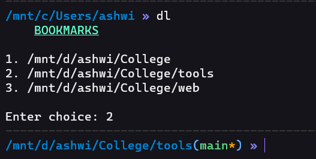
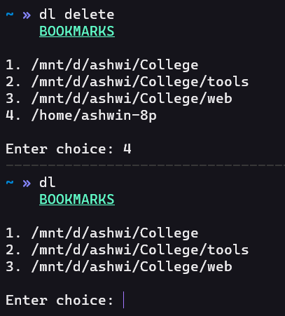

# Bookmark-directories
Have list of paths to your frequently using directories for quick access in your linux terminal.

# Requirements
<li>Bash shell

# Installation

- Add a `alias` which runs the bash script with source in your startup file. 

- You can find your startup file in your `root ~`.
   - Startup file for bash shell `./bashrc or ./bash_profile`
   - If u use zsh `./zshrc`
   
- Add this alias to your startup file `alias dl="source <path to bash script>"`
   - sample : `alias dl="source /mnt/d/ashwi/College/tools/Dlists.sh"`

- In the Dlists.sh file 
   - Change the path to the txt file where the paths are stored ie `filename=<full path to List.txt file>`

# Commands
### dl

### dl add "path of new file to be added"

### dl delete

