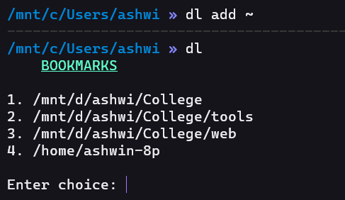

# Bookmark-directories
Have list of paths to your frequently using directories for quick access in your linux terminal.

# Requirements
<li>Bash shell

# Installation

Add a `alias` which runs the bash script with source in your startup file. 

You can find your startup file in your `root ~`.

Startup file for bash shell `./bashrc or ./bash_profile`
   
If u use zsh `./zshrc`
   
`alias dl="source <path to bash script>"`
   
sample : `alias dl="source /mnt/d/ashwi/College/tools/Dlists.sh"`

# Commands
### dl

### dl add <path of new file to be added>

### dl delete

